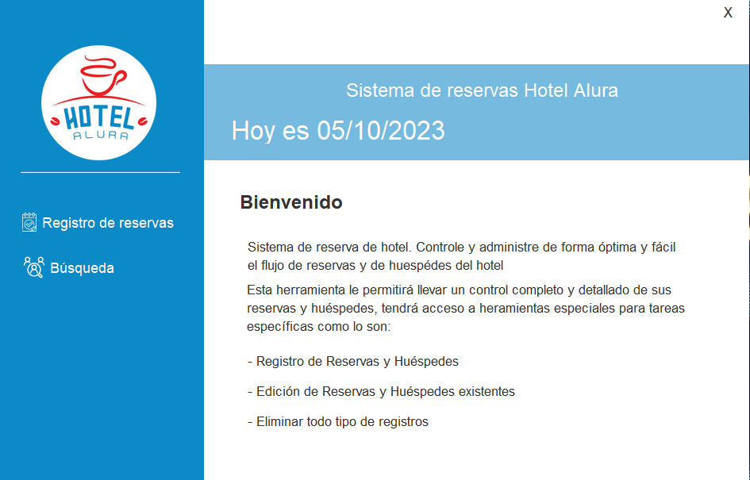
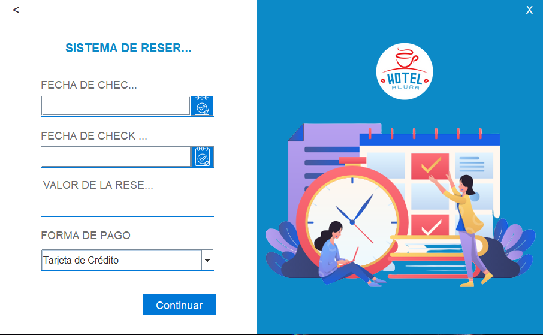
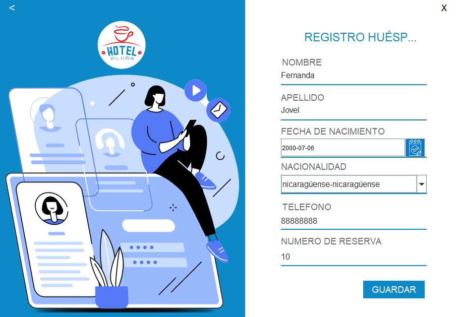
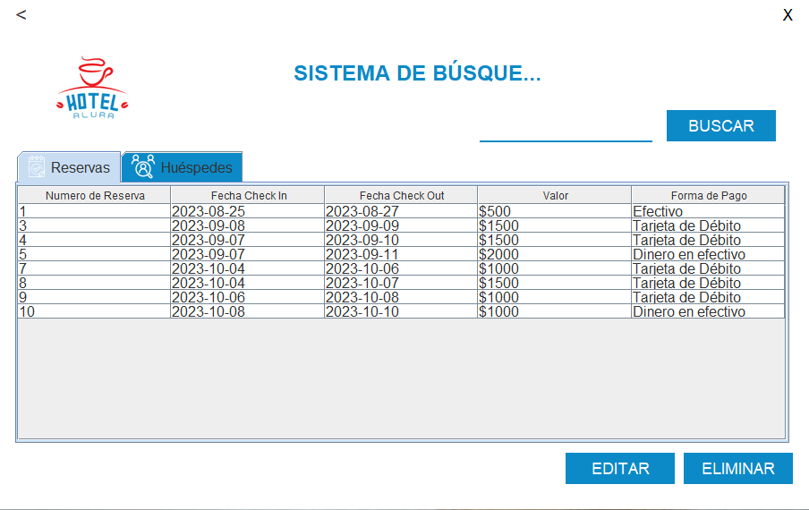
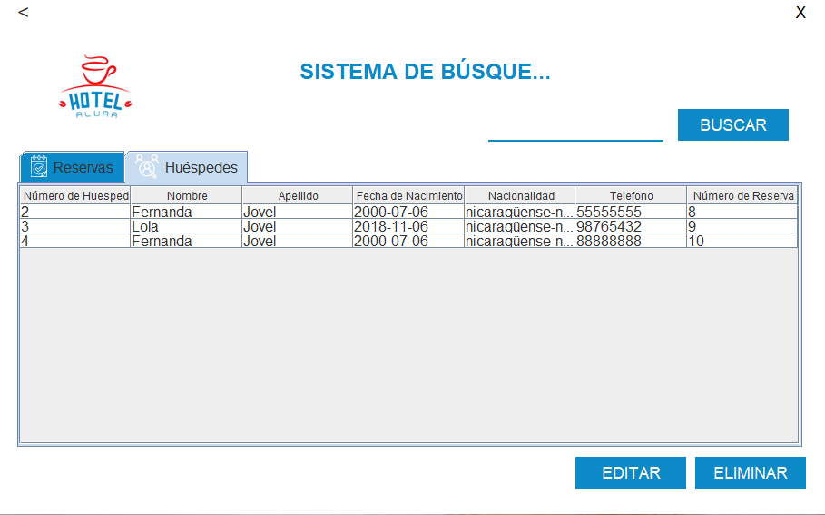

# Hotel Alura

El hotel Alura🏨🗽 en una aplicacion de escritorio de administracion de reservas de habitaciones y huespedes de un hotel. Los datos se almacenan en una base de datos local en formato MySQL. La aplicacion esta desarrollada en Java con JPA y Java Swing para las interfaces graficas.

## Caracteristicas
1. Inicio de sesion con usuario y contraseña.
2. Registro de huespedes.
3. Registro de reservaciones.
4. Listado, edicion y eliminacion de huespedes de huespedes.
5. Listado, edicion y eliminacion de reservaciones de reservaciones.

## Instalacion
1. Clonar el repositorio.
2. Crear una base de datos en MySQL con el nombre de `hotel_alura`.
3. Ejecutar el script `hotel_alura.sql` en la base de datos creada.
4. Ejecutar el archivo `hotelAlura.jar`.

## Uso
1. Iniciar sesion con el usuario `admin` y la contraseña `admin`.
2. En la ventana principal se puede acceder a las opciones de registro y listado de huespedes y reservaciones.
3. En la ventana de listado se puede acceder a las opciones de edicion y eliminacion de huespedes y reservaciones.
4. En la ventana de registro se puede registrar una nueva reservacion con su respectivo huesped.

## Contribucion
Los pull requests son bienvenidos. Para cambios importantes, primero abra un problema para discutir qué le gustaría cambiar o añadir al proyecto.

## Licencia
[MIT](https://choosealicense.com/licenses/mit/)

## Contacto
- Email: [Maria Jovel](mailto:fermajobe@gmail.com)
- LinkedIn: [Maria Jovel](https://www.linkedin.com/in/maria-fernanda-jovel/)

## Agradecimientos
A [Alura](https://www.alura.com.br/) por el curso de Java y JPA, a [OracleNextEducation](https://www.oracle.com/mx/education/oracle-next-education/) por la oportunidad de formar parte de este maravilloso programa y a mi familia por apoyarme incondicionalmente en todos mis proyectos.

## Screenshots
### Menu Principal

### Login

### Menu de usuario

### Registro de reservas

### Registro de huespedes

### Listado de reservas

### Listado de huespedes
